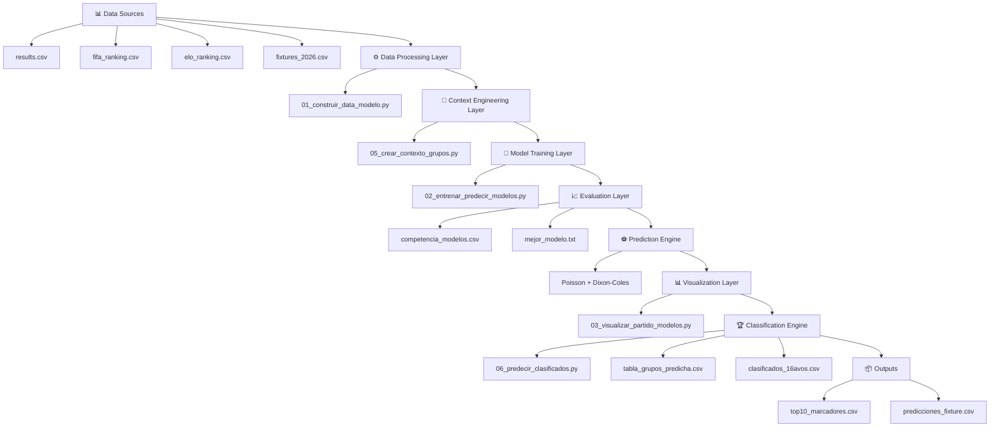

# ⚽ MODELO MUNDIAL 2026 - COMPETENCIA DE MODELOS Y CONTEXTO COMPETITIVO


> Sistema de predicción de resultados del Mundial 2026 basado en modelos de regresión y contexto competitivo

# 👥 INTEGRANTES DEL PROYECTO

Este proyecto fue desarrollado por el siguiente equipo:

- 👤 **Integrante 1:** BUSTAMANTE VELA JEAN FRANK
- 👤 **Integrante 2:** MARREROS CORTEGANA MIGUEL ANGEL 
- 👤 **Integrante 3:** FERNANDEZ CAMPOS VALENTIN 
- 👤 **Integrante 4:** SALON TRIGOSO FRANK

```
```
📌 **Curso:** MODELOS DE REGRESIÓN Y APRENDIZAJE SUPERVISADO / Ciencia de Datos / Machine Learning  
📌 **Proyecto:** Modelo Mundial 2026 - Predicción de resultados  
📌 **Institución:** Universidad Nacional Toribio Rodríguez de Mendoza de Amazonas

# 📄 ABSTRACT

Este proyecto construye un sistema de predicción de resultados para el Mundial 2026 basado en múltiples modelos de regresión.  
El sistema estima goles esperados por partido, evalúa distintos modelos predictivos y posteriormente ajusta las predicciones mediante un componente de contexto competitivo asociado a la fase de grupos.

El objetivo es generar:

- probabilidades de resultado (victoria local, empate, victoria visitante)  
- estimación de marcadores más probables  
- simulación de clasificación a la siguiente fase del torneo  

El modelo integra información histórica, ranking FIFA, Elo y dinámica competitiva.

---

## 🏛️ Arquitectura del Sistema

Este sistema sigue una arquitectura modular de machine learning con múltiples capas de procesamiento.


---

# 🏗️ METHODOLOGY (PIPELINE GENERAL)
```
DATA HISTÓRICA
↓
FEATURE ENGINEERING
↓
ENTRENAMIENTO DE MODELOS
↓
PREDICCIÓN DE GOLES (λ_home, λ_away)
↓
EVALUACIÓN (MAE, RMSE, R2)
↓
SELECCIÓN DEL MEJOR MODELO
↓
AJUSTE POR CONTEXTO COMPETITIVO
↓
POISSON + DIXON-COLES → PROBABILIDADES FINALES
↓
SIMULACIÓN DE CLASIFICACIÓN (FASE DE GRUPOS)
↓
DETERMINACIÓN DE CLASIFICADOS A SIGUIENTE FASE
```
---

## 📁 **Estructura del Proyecto**

```
modelo regresion/
│
├── data/
│   ├── results.csv
│   ├── fifa_ranking.csv
│   ├── elo_ranking.csv
│   ├── fixtures_2026.csv
│   ├── fixtures_2026_group_stage.csv
│   ├── data_modelo.csv
│   ├── fixtures_modelo.csv
│   └── fixtures_contexto_grupos.csv
│
├── outputs/
│   ├── competencia_modelos.csv
│   ├── mejor_modelo.txt
│   ├── modelo_home.pkl
│   ├── modelo_away.pkl
│   ├── predicciones_fixture.csv
│   ├── predicciones_todos_modelos.csv
│   ├── top10_marcadores.csv
│   ├── top10_todos_modelos.csv
│   ├── tabla_grupos_predicha.csv
│   ├── clasificados_grupos.csv
│   ├── mejores_terceros.csv
│   ├── clasificados_16avos.csv
│   ├── cruces_16avos_predichos.csv
│   └── panel_tablas_grupos.png
│
├── 00_actualizar_results_mundial.py
├── 01_construir_data_modelo.py
├── 02_entrenar_predecir_modelos.py
├── 03_visualizar_partido_modelos.py
├── 04_mostrar_modelo_final.py
├── 05_crear_contexto_grupos.py
├── 06_predecir_clasificados.py
├── 07_predecir_clasificados.py
├── requirements.txt
└── README.txt
```

---
# ⚙️ REQUIREMENTS
```
pip install -r requirements.txt
numpy
pandas
scipy
scikit-learn
matplotlib
joblib
```

---
# 🚀 EXECUTION PIPELINE
```
1) cd "/home/jeanki/Escritorio/modelo regresion"

2) python 00_actualizar_results_mundial.py

3) python 01_construir_data_modelo.py

4) python 05_crear_contexto_grupos.py

5) python 02_entrenar_predecir_modelos.py

6) python 03_visualizar_partido_modelos.py (MATCH_ID = 60)

7) python 04_mostrar_modelo_final.py

8) python 06_predecir_clasificados.py

9) 07_predecir_octavos.py
```
---

# 🤖 MODELOS
```
- Linear Regression
- Ridge
- Random Forest
- Gradient Boosting
- Poisson Regressor
```
---

# 📊 FEATURES
```
- home_gf12
- home_ga12
- home_pts12
- ome_prev_matches
- way_gf12
- away_ga12
- away_pts12
- away_prev_matches
- diff_fifa
- diff_elo
- h2h
- neutral
- home_advantage
```
---

# 🎯 CONTEXT
```
lambda_home_final = lambda_home_base * factor_contexto_home  
lambda_away_final = lambda_away_base * factor_contexto_away  

- 1.15 = must win  
- 0.90 = rotation  
- 1.00 = neutral   
```
---

# 📦 OUTPUTS
```
-competencia_modelos.csv
-mejor_modelo.txt
-predicciones_fixture.csv
-top10_marcadores.csv
-tabla_grupos_predicha.csv
-clasificados_16avos.csv
-cruces_16avos_predichos.csv
```
---

# ⚽ Clasificados a dieciseisavos de final — Mundial 2026

Estas son las **32 selecciones** que, según la predicción del modelo, avanzaron a los dieciseisavos de final. Los equipos están organizados por grupo y posición de clasificación.

## Grupo A

| Posición | Selección |
|:---:|---|
| 1.º | México |
| 2.º | Sudáfrica |
| Mejor tercero | Corea del Sur |

## Grupo B

| Posición | Selección |
|:---:|---|
| 1.º | Suiza |
| 2.º | Canadá |
| Mejor tercero | Bosnia y Herzegovina |

## Grupo C

| Posición | Selección |
|:---:|---|
| 1.º | Brasil |
| 2.º | Marruecos |

## Grupo D

| Posición | Selección |
|:---:|---|
| 1.º | Estados Unidos |
| 2.º | Australia |
| Mejor tercero | Turquía |

## Grupo E

| Posición | Selección |
|:---:|---|
| 1.º | Alemania |
| 2.º | Costa de Marfil |
| Mejor tercero | Ecuador |

## Grupo F

| Posición | Selección |
|:---:|---|
| 1.º | Países Bajos |
| 2.º | Japón |
| Mejor tercero | Suecia |

## Grupo G

| Posición | Selección |
|:---:|---|
| 1.º | Egipto |
| 2.º | Bélgica |
| Mejor tercero | Irán |

## Grupo H

| Posición | Selección |
|:---:|---|
| 1.º | España |
| 2.º | Cabo Verde |

## Grupo I

| Posición | Selección |
|:---:|---|
| 1.º | Francia |
| 2.º | Noruega |
| Mejor tercero | Senegal |

## Grupo J

| Posición | Selección |
|:---:|---|
| 1.º | Argentina |
| 2.º | Austria |

## Grupo K

| Posición | Selección |
|:---:|---|
| 1.º | Colombia |
| 2.º | Portugal |

## Grupo L

| Posición | Selección |
|:---:|---|
| 1.º | Inglaterra |
| 2.º | Croacia |
| Mejor tercero | Ghana |

> Fuente: `outputs/clasificados_16avos.csv`.


# Clasificados de 16avos a octavos de final

| N.º | Partido de 16avos | Resultado | Clasificado a octavos |
|---:|---|:---:|---|
| 1 | South Africa vs. Canada | 0-1 | Canada |
| 2 | Brazil vs. Japan | 2-1 | Brazil |
| 3 | Germany vs. Paraguay | 1-1 (3-4 en penales) | Paraguay |
| 4 | Netherlands vs. Morocco | 1-1 (2-3 en penales) | Morocco |
| 5 | Ivory Coast vs. Norway | 1-2 | Norway |
| 6 | France vs. Sweden | 3-0 | France |
| 7 | Mexico vs. Ecuador | 2-0 | Mexico |
| 8 | England vs. DR Congo | 2-1 | England |
| 9 | Belgium vs. Senegal | 3-2 | Belgium |
| 10 | United States vs. Bosnia and Herzegovina | 2-0 | United States |
| 11 | Spain vs. Austria | 3-0 | Spain |
| 12 | Portugal vs. Croatia | 2-1 | Portugal |
| 13 | Switzerland vs. Algeria | 2-0 | Switzerland |
| 14 | Australia vs. Egypt | 1-1 (2-4 en penales) | Egypt |
| 15 | Argentina vs. Cape Verde | 3-2 | Argentina |
| 16 | Colombia vs. Ghana | 1-0 | Colombia |


# ⚠️ NOTE
```
El modelo no garantiza el resultado real de los partidos.
Su objetivo es estimar probabilidades usando información histórica, forma reciente, 
ranking, Elo, historial y contexto competitivo del grupo.
```
