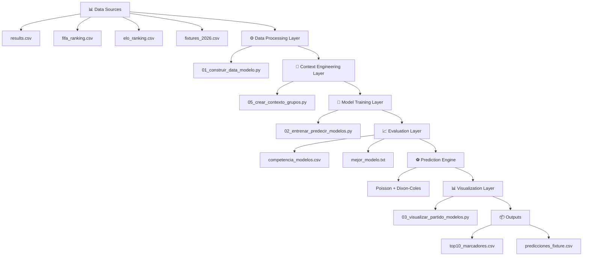

# ⚽ MODELO MUNDIAL 2026 - COMPETENCIA DE MODELOS Y CONTEXTO COMPETITIVO


> Sistema de predicción de resultados del Mundial 2026 basado en modelos de regresión y contexto competitivo

---

# 📄 ABSTRACT

Este proyecto construye un sistema de predicción de resultados para el Mundial 2026 basado en múltiples modelos de regresión.  
El sistema estima goles esperados por partido, evalúa distintos modelos predictivos y posteriormente ajusta las predicciones mediante un componente de contexto competitivo asociado a la fase de grupos.

El objetivo es generar probabilidades robustas de resultado (victoria local, empate, victoria visitante) y distribución de marcadores más probables, integrando información histórica, ranking FIFA, Elo y dinámica competitiva.

---
## 🏛️ Arquitectura del Sistema

Este sistema sigue una arquitectura modular de machine learning con múltiples capas de procesamiento.


# 🧠 SYSTEM OVERVIEW
```
El modelo genera:

- Competencia entre modelos  
- Mejor modelo según MAE promedio  
- Predicción de goles esperados  
- Probabilidades de victoria local, empate y visitante  
- Top 10 marcadores más probables  
- Ajuste por contexto competitivo  
- Gráficos y análisis por partido  
```
---

# 🏗️ METHODOLOGY (PIPELINE GENERAL)
```
DATA HISTÓRICA
↓
FEATURE ENGINEERING
↓
ENTRENAMIENTO DE MODELOS
↓
PREDICCIÓN DE GOLES (λ_home, λ_away)
↓
EVALUACIÓN (MAE, RMSE, R2)
↓
SELECCIÓN DEL MEJOR MODELO
↓
AJUSTE POR CONTEXTO COMPETITIVO
↓
POISSON + DIXON-COLES → PROBABILIDADES FINALES
```
---

## 📁 **Estructura del Proyecto**

```
modelo regresion/
│
├── data/
│   ├── results.csv
│   ├── fifa_ranking.csv
│   ├── elo_ranking.csv
│   ├── fixtures_2026.csv
│   ├── fixtures_2026_group_stage.csv
│   ├── data_modelo.csv
│   ├── fixtures_modelo.csv
│   └── fixtures_contexto_grupos.csv
│
├── outputs/
│   ├── competencia_modelos.csv
│   ├── mejor_modelo.txt
│   ├── modelo_home.pkl
│   ├── modelo_away.pkl
│   ├── predicciones_fixture.csv
│   ├── predicciones_todos_modelos.csv
│   ├── top10_marcadores.csv
│   ├── top10_todos_modelos.csv
│   └── graficos generados
│
├── 00_actualizar_results_mundial.py
├── 01_construir_data_modelo.py
├── 02_entrenar_predecir_modelos.py
├── 03_visualizar_partido_modelos.py
├── 04_mostrar_modelo_final.py
├── 05_crear_contexto_grupos.py
├── requirements.txt
└── README.txt
```

---
# ⚙️ REQUIREMENTS
```
pip install -r requirements.txt

Librerías:
- numpy
- pandas
- scipy
- scikit-learn
- matplotlib
- joblib
```

---
# 🚀 EXECUTION PIPELINE
```
1) cd "/home/jeanki/Escritorio/modelo regresion"

2) python 00_actualizar_results_mundial.py

3) python 01_construir_data_modelo.py

4) python 05_crear_contexto_grupos.py

5) python 02_entrenar_predecir_modelos.py

6) python 03_visualizar_partido_modelos.py (MATCH_ID = 60)

7) python 04_mostrar_modelo_final.py
```
---

# 🤖 MODELOS
```
- Linear Regression
- Ridge
- Random Forest
- Gradient Boosting
- Poisson Regressor
```
---

# 📊 FEATURES
```
- home_gf12
- home_ga12
- home_pts12
- home_prev_matches
- away_gf12
- away_ga12
- away_pts12
- away_prev_matches
- diff_fifa
- diff_elo
- h2h
- neutral
- home_advantage
```
---

# 🎯 CONTEXT
```
lambda_home_final = lambda_home_base * factor_contexto_home  
lambda_away_final = lambda_away_base * factor_contexto_away  

- 1.15 = must win  
- 0.90 = rotation  
- 1.00 = neutral  
```
---

# 📦 OUTPUTS
```
- competencia_modelos.csv
- mejor_modelo.txt
- predicciones_todos_modelos.csv
- predicciones_fixture.csv
- top10_marcadores.csv
```
---

# ⚠️ NOTE
```
El modelo no garantiza el resultado real de los partidos.
Su objetivo es estimar probabilidades usando información histórica, forma reciente, 
ranking, Elo, historial y contexto competitivo del grupo.
```
